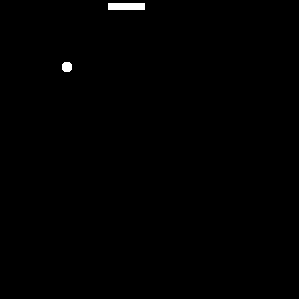
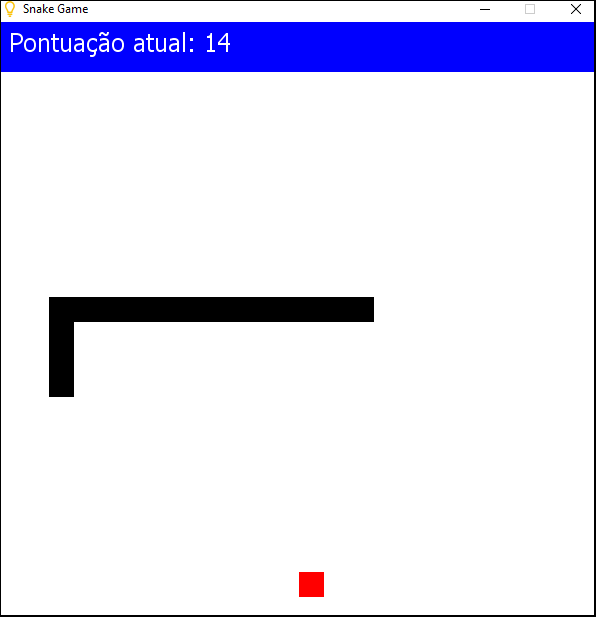

# Portugol Snake

***

## 1. Sobre o jogo

- *Serpente* é um jogo que ficou conhecido por diversas versões cuja versão inicial começou com o jogo Blockade de 1976, sendo feitas várias imitações em vídeo-games e computadores. No fim dos anos 90 foi popularizado em celulares da Nokia que vinham com o jogo já incluso. 

#### Como jogar:

O objetivo do jogo é alimentar uma cobra o maior tempo possível guiando-a até uma "maçã" no tabuleiro do jogo. A cobra não pode parar de se mover e morre sempre que atinge algo (excluindo maçãs). Como a cobra está crescendo cada vez mais à medida que ela come, fica cada vez mais difícil evitar colisões com a própria cobra ou com a parede, por exemplo. O jogador pode mudar a direção da cabeça da cobra usando as setas do teclado ← ↑ → ↓. Na etapa do jogo, sempre há uma maçã em algum lugar do tabuleiro. Se a cobra come uma maçã, a cobra fica uma célula a mais por passo. Uma nova maçã é colocada em um local aleatório, excluindo todos os lugares cobertos pela cobra. Quando a cobra bate em uma extremidade do tabuleiro, o jogo reinicia, a pontuação zera e ela ressurge no centro do tabuleiro.
O jogo é bem intuitivo, é mais fácil entendê-lo melhor jogando você mesmo. 

---
## 2. Desenvovilmento 

Através do [curso](https://moodle.ifrs.edu.br/mod/page/view.php?id=226771&forceview=1) de lógica de programação do Instituto Federal do Rio Grande do Sul, tive a oportunidade de conhecer a linguagem Portugol. O jogo foi desenvolvido com o intuito de praticar a matéria ensinada. O interessante desse exercício é que ele deixa evidente a necessidade de planejar ações para resolver o jogo. E essas ações foram divididas em baby steps, como: 

- Importar bibliotecas necessárias
- criar função montar janela
- criar looping game
- criar função pintar janela
- criar função desenhar painel
- criar função desenhar cabeca cobra
- criar função direcionar cobra
- criar função mover cobra
- criar função cobra bateu parede
- criar função reiniciar 
- criar função cobra comeu comida
- criar função sortear posicao comida
- criar função desenhar comida
- criar função atualizar posicoes cobra
- criar função desenhar cauda cobra
- criar função atualizar pontuacao
- criar função cobra se mordeu
- criar função comida embaixo cobra
- criar README

Essa foi minha organização.

---

## 3. Tela do jogo

---

## 4. Autora

     
  

  <h3 align="center"><a href="https://github.com/Maryssun">Dayanne Maryssol de Andrade Almeida</a></h3>
  <h4 align="center">Projeto do Bootcamp da <em><a href="https://hub.laboratoria.la/br">Laboratoria</a></em></h4>
  

    
     
  

